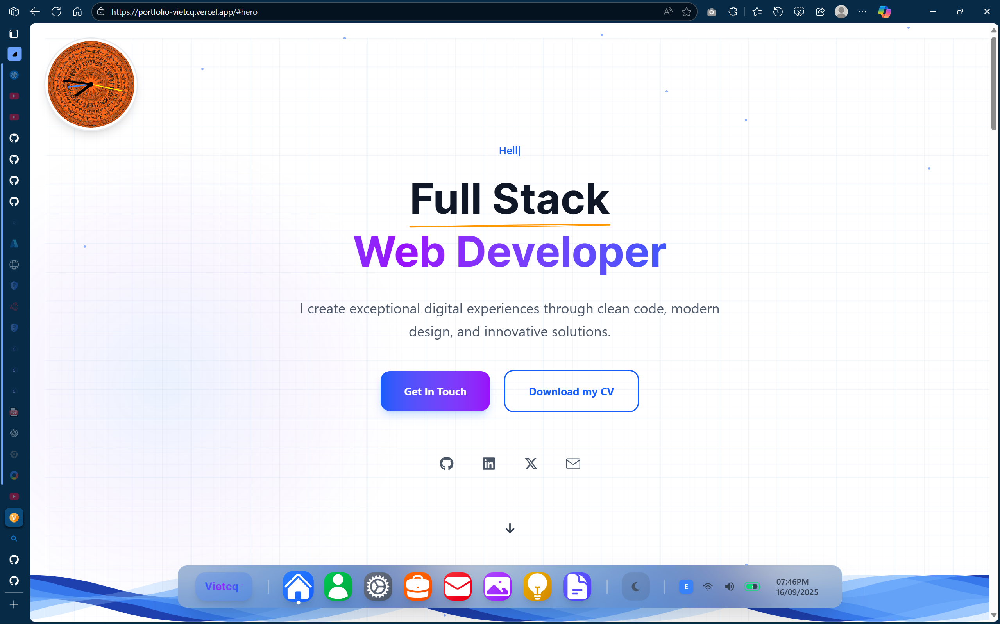

# Portfolio Vietcq

> **Note:** The live demo at [portfolio-vietcq.vercel.app](https://portfolio-vietcq.vercel.app/) reflects v0.0.1 and is outdated. A new deployment with the latest features is coming soon.

A modern portfolio website with a built-in blog engine, macOS-inspired dock navigation, and multi-palette theming system. Built with Next.js 15 + PocketBase.

## Releases

| Tag | Highlights |
|-----|-----------|
| [v0.2.3](https://github.com/CaoQuocViet/portfolio-vietcq/releases/tag/v0.2.3) | Palette system (8 themes), CSS variable migration |
| v0.2.2 | Blog UI overhaul, design system tokens, modular hooks |
| v0.2.1 | i18n (EN/VI), TanStack Query data fetching |
| v0.1.1 | Blog engine (PocketBase), RSS/Atom/JSON feeds, sitemap |
| [v0.0.1](https://github.com/CaoQuocViet/portfolio-vietcq/releases/tag/v0.0.1) | Initial release — portfolio UI, 3D model, gallery, blog |

See [CHANGELOG.md](CHANGELOG.md) for full details.

## Features

- **macOS-style Dock** — navigation with hover magnification and debounced edge handling
- **8 Color Palettes** — Dusty Denim, Coffee, Forest, Slate, Imperial Violet, Peach Glow, Azure Mist, Graphite
- **Dark/Light Theme** — system detection + manual toggle, all via CSS custom properties
- **3D Elements** — React Three Fiber with lazy-loaded GLB model
- **Blog Engine** — PocketBase backend with RSS/Atom/JSON feeds, sitemap, full-text search
- **i18n** — English and Vietnamese translations across all components
- **Reading Progress** — scroll-based progress bar on blog posts
- **Skeleton Loading** — shimmer placeholders instead of spinners
- **Accessibility** — skip-to-content, focus-visible, ARIA labels, reduced-motion support
- **Gallery System** — project showcase with auto-scrolling and responsive layouts
- **Docker Deployment** — client + server containers via docker-compose

## Tech Stack

| Layer | Technologies |
|-------|-------------|
| Frontend | Next.js 15, React 19, Tailwind CSS 4, Framer Motion |
| Backend | PocketBase (Go 1.24), SQLite |
| Data | TanStack Query v5, PocketBase REST API |
| 3D | Three.js, React Three Fiber, Drei |
| UI | Lucide React, Sonner (toasts), CVA, clsx |
| i18n | Custom context with EN/VI JSON locales |
| Deploy | Docker, docker-compose |

## Quick Start

```bash
git clone https://github.com/CaoQuocViet/portfolio-vietcq.git
cd portfolio-vietcq
```

### Client

```bash
cd client
pnpm install
pnpm dev          # http://localhost:5678
pnpm build        # production build
```

### Server

```bash
cd server
go build -o pb ./examples/base
./pb serve        # http://localhost:8090
```

### Docker

```bash
docker-compose up -d
```

## Project Structure

```
portfolio-vietcq/
├── client/                    # Next.js 15 frontend
│   ├── src/
│   │   ├── app/               # App Router pages
│   │   ├── components/
│   │   │   ├── layout/        # Hero, About, Services, Projects, Contact, Footer
│   │   │   ├── dock/          # macOS dock + modal
│   │   │   ├── blog/          # BlogList, BlogPost, BlogCard, filters, pagination
│   │   │   ├── gallery/       # Gallery system
│   │   │   ├── project/       # Project detail views
│   │   │   └── ui/            # ErrorBoundary, PaletteSwitcher, GridBackground
│   │   ├── hooks/             # TanStack Query hooks (use-blog-*)
│   │   ├── lib/               # PocketBase client
│   │   ├── contexts/          # Language context
│   │   └── locales/           # EN/VI translations
│   └── global.css             # Design system tokens + palettes
├── server/                    # PocketBase backend (Go)
│   ├── core/                  # App interface, models, hooks, fields
│   ├── apis/                  # REST API handlers, middleware
│   └── examples/base/         # Entry point
├── docker-compose.yml
├── CHANGELOG.md
├── CONTRIBUTING.md
└── README.md
```

## Author

**Cao Quoc Viet (Vietcq)**

- GitHub: [@CaoQuocViet](https://github.com/CaoQuocViet)
- Email: [vietcao10@gmail.com](mailto:vietcao10@gmail.com)
- LinkedIn: [Cao Quoc Viet](https://linkedin.com/in/cao-quoc-viet-a10841230)

## License

MIT — see [LICENSE](LICENSE) for details.
